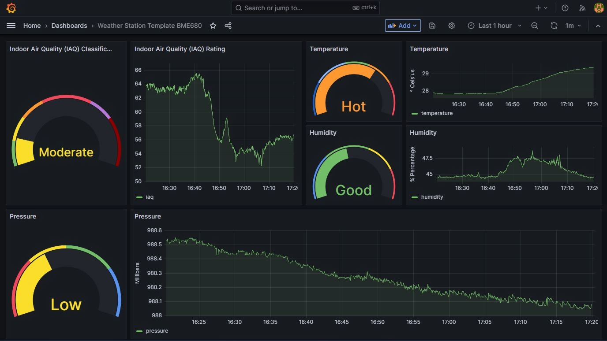

## BME680 Weather Station

### Overview

This script interfaces with the BME680 environmental sensor, retrieves its readings, and saves the data into a QuestDB database. It covers temperature, humidity, pressure, gas resistance and Indoor Air Quality (IAQ) readings.

###  Set up parameter:

After installing the AI Agent Host, open VS Code in your browser through an HTTPS connection. Navigate to `>project/weather-station/data-stream-processing.py`.
The script is pre-configured to connect to a QuestDB instance using the following credentials:

```
dbname="qdb",
user="admin",
password="quest",
host="docker_host_ip_address",
port="8812"
```

Remember to replace **<docker_host_ip_address>** with the actual IP address of the Docker host where your server is running

### Weather Data query

```
-- Retrieve the timestamp and data values: temperature, humidity, pressure, iaq

SELECT
    timestamp,        -- Select the timestamp of the data
    data              -- Select the data value
FROM  
    weather_data      -- From the 'weather_data' table
WHERE 
    timestamp > dateadd('d', -1, now()); -- Only select data from the past 24 hours

```

This Grafana query retrieves the timestamp and corresponding data values from the **weather_data** table. It's specifically designed to only fetch data from the last 24 hours, ensuring that dashboard viewers are presented with the most recent day's data trends. By focusing on this short timeframe, users can gain insights into daily data fluctuations and patterns, which can be especially valuable for real-time monitoring or short-term data analysis.


### Run Python File in Terminal:
Execute the Python script from the terminal to start collecting weather data.

### Connect to Grafana Dashboard:
Open your browser and navigate to the Grafana interface. Select the weather station dashboard to start monitoring your data in real-time.



### Advanced Customization: Accurate IAQ, VOC, and CO2 Data with LCD monitor

If you're interested in obtaining more accurate Indoor Air Quality (IAQ), Volatile Organic Compounds (VOC), and CO2 data, you can modify the Python script to incorporate a C library specific to your sensor. After updating the Python script, you'll also need to update the Grafana dashboard to include these new metrics. This ensures that your enhanced and more precise environmental data will be accurately reflected on your Grafana dashboard.

Additionally, consider integrating an LCD monitor to your Raspberry Pi setup. This customizable enhancement complements Grafana's web-based visualization, providing flexibility in monitoring and interacting with your data.